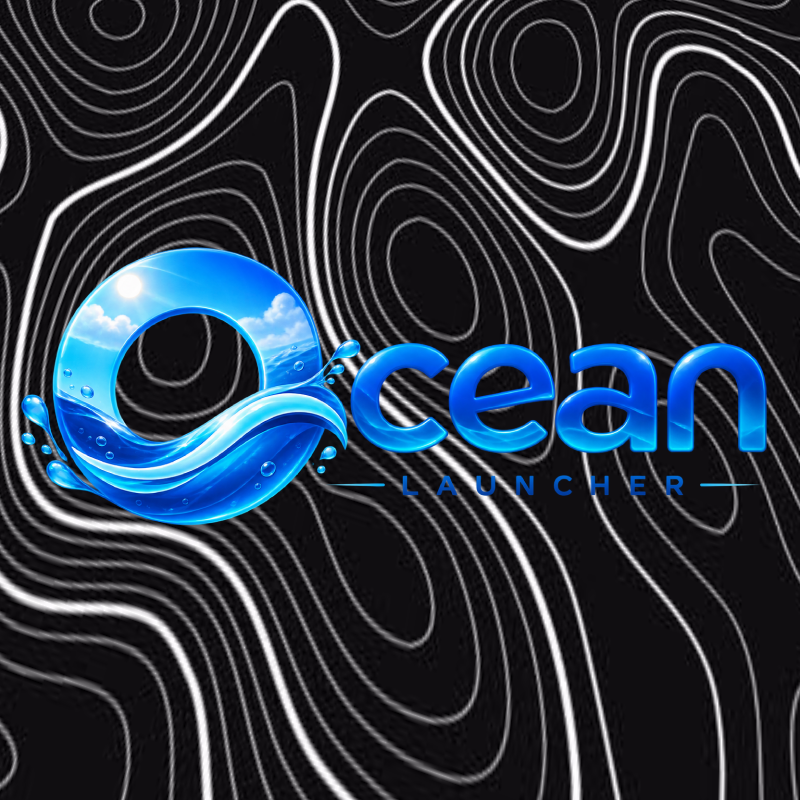

  <h1>Zenith-Launcher</h1>
  
<strong>A Minecraft: Java Edition Launcher for iOS based on PojavLauncher</strong>

---

## 📱 Overview

Zenith-Launcher is a custom build of AngelAuraAmethyst iOS, specifically tailored to launch Minecraft 26.x.x, including the latest snapshots. It brings the full Minecraft: Java Edition experience to iOS devices (iOS 14 and later), featuring proper TXM logic and compatibility with iOS 26 and iOS 27 beta.

> **Note:** This project is completely unofficial. Please do not bother the Amethyst developers if something breaks. Instead, post an issue in this repository, and we will look into it.

## ✨ Key Features

- **Broad iOS Support:** Compatible with all versions of iOS 14 and later, including iOS 26 and iOS 27 beta.

- **Latest Minecraft Versions:** Supports launching Minecraft 26.x.x and snapshots.

- **Custom Java & LWJGL:** Bundles a custom `lwjgl` version and Java 25 for optimal compatibility.

- **Keyboard Support:** Fully functional keyboard integration.

- **Renderer Options:**
  - **Zinc Renderer (Mesa 25 via MoltenVK):** Recommended for best performance.
  - **LTW Renderer:** Recommended for playing version 1.21.1 and below.
  - **Vulkan:** Launch with MobileGlues or Zinc and change your Preferred Graphics API to Vulkan.

## 🚀 Current Status & Known Issues

- **SDL3 Transition:** Mojang is moving the windowing and keyboard system from GLFW to SDL3. Assistance is needed to make Amethyst use this. If you can help, please check the Issues tab.

- **Newest Snapshots:** Currently unsupported due to the SDL3 transition (work in progress).

- **Java Compatibility:**
  - **Java 8:** Works without any special configuration.
  - **Java 21:** Most older versions will launch by selecting Java 25 as the Java version.
  - **Java 17:** Currently unsupported. You can install normal Amethyst alongside this version due to different bundle identifiers.

## 🛠️ Compiling

Compiling is supported but **not recommended** for general users.

The build process automatically uses the custom `lwjgl.jar` located at the project root. This `lwjgl.jar` is a modified version of LWJGL 3.3.3 that provides compatibility with LWJGL 3.4.1 API calls.

## 🙏 Acknowledgements

- **vibecodest:** For their source code.

- **@Ynnyny & @DuyAnh662:** For helping with code and rendering under the hood.

- **@T1k-T1k & @DuyAnh662:** For fixing the keyboard.

- **@T1k-T1k:** For making compiling possible.

- **MCHeads:** For providing Minecraft avatars.

## 📜 Third-Party Components & Licenses

This project utilizes several third-party components. Below is a list of these components and their respective licenses:

| Component | License |
| --- | --- |
| **Caciocavallo** | GNU GPLv2 |
| **jsr305** | 3-Clause BSD |
| **Boardwalk** | Apache 2.0 |
| **GL4ES** (@lunixbochs, @ptitSeb) | MIT |
| **Mesa 3D Graphics Library** | MIT |
| **MetalANGLE** (@kakashidinho & ANGLE team) | BSD 2.0 |
| **MoltenVK** | Apache 2.0 |
| **openal-soft** | LGPLv2 |
| **Azul Zulu JDK** | GNU GPLv2 |
| **LWJGL3** | BSD-3 |
| **LWJGLX** | Unknown |
| **DBNumberedSlider** | Apache 2.0 |
| **fishhook** | BSD-3 |
| **shaderc** | Apache 2.0 |
| **NRFileManager** | MPL-2.0 |
| **UnzipKit** | BSD-2 |
| **LTW render** | LGPL-3.0 |

*Other components include AltKit and DyldDeNeuralyzer (bypasses Library Validation for loading external runtime).*

---

<i>Zenith-Launcher is licensed under the GPL-3.0 License.</i>

